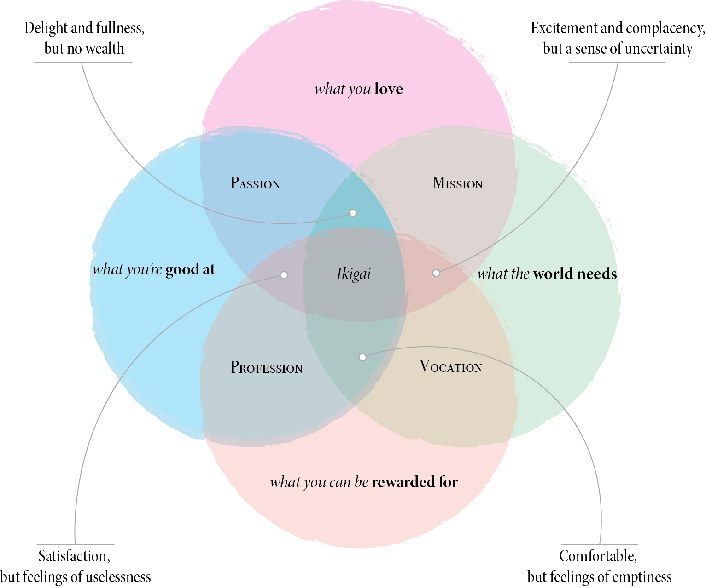

# Week 1: Aug 27

**Topic**  
Discovering our _Ikigai_: What motivates us?

_Ikigai_ is a Japanase concept that roughly translates into "reason for being" -- a long history of literature has examined the relationship between something like _Ikigai_ (e.g., a sense of [instrinsic motivation](https://en.wikipedia.org/wiki/Motivation#Types_of_motivation)) and happiness. _Ikigai_ is traditionally composed of four parts that can overlap in various ways:

1. what you love: things that excite and interest you
2. what you're good at: the skills you possess 
3. what the world needs: service that brings value to others
4. what you can be rewarded for: skills that may translate into a paycheck, or provide benefits in some way

{width="90%"}

Obviously, you can love things that you aren't particularly good at, or that you can't get paid to do. I love playing guitar but no one would ever pay to hear me play. The trick is to reflect on each component separately, and then see if there are any skills or activities that overlap. 

Independent research challenges: it takes us past our comfort zones to a place where we feel totally uncertain. Since we all have different dispositions and abilities, the _specific_ ways independent research challenges each person is unique to them. For me, I struggle constantly with anxiety that stems from fear of failure. My instinct is to avoid situations where I may say or do the wrong thing. But the big problem is that making mistakes is how we learn! By avoiding mistakes, I am basically avoiding growing and developing in my field. 

What pushes me past that anxiety to a place where I _can_ grow and develop in my field? My intrinsic motivation: I love my work and I believe it is valuable to the world. My work also fits well with my disposition and personality: I would not enjoy sitting at a lab bench for hours plating bacteria, but I have many friends that do. It is important that the work we choose is something that we can actually see ourselves doing and enjoying. So this week, we will use the _Ikigai_ model as a guide to help us reflect on our personalities and dispositions, and how we may translate our unique gifts and interests into work that we find exciting and personally motivating. 

## Watch

**How to know your life purpose in 5 minutes | Adam Leipzig**  
<iframe width="560" height="315" src="https://www.youtube.com/embed/vVsXO9brK7M" title="YouTube video player" frameborder="0" allow="accelerometer; autoplay; clipboard-write; encrypted-media; gyroscope; picture-in-picture" allowfullscreen></iframe>

**Job versus Career | Chris Rock**    
<iframe width="560" height="315" src="https://www.youtube.com/embed/-vSMrnFQyhI?start=131" title="YouTube video player" frameborder="0" allow="accelerometer; autoplay; clipboard-write; encrypted-media; gyroscope; picture-in-picture" allowfullscreen></iframe>

## Read

+ Journal article: ["Life Crafting as a Way to Find Purpose and Meaning in Life"](https://uofi.box.com/s/v99si549gl6jj6vktxulpjekq9h3q06e)
+ Journal article: ["Purpose-Centered Career Development: A Strengths-Based Approach to
Finding Meaning and Purpose in Careers"](https://uofi.box.com/s/xcg79ha7728ye531k9nh7vuz13g4mrzz)
+ Book excerpt: [_The Art of Work_](https://uofi.box.com/s/zt793mc7rthv4uf3mz2ly7wst6y1oz7s) (_optional_)

## Do

_Due no later than Thursday, September 2nd at 11:59p_

1. [Download blank _Ikigai_ diagram and fill out components.](images/ikigai-blank.pdf) You don't need to turn this in if you don't want to (but you can!) -- it's for your own reflection.
2. Write two paragraphs reflecting on what you learned in your reading and through this exercise. Submit as a Word document, PDF, or text file.

[[SUBMIT ASSIGNMENT](mailto:Assignm.h16uafu1jl96pxla@u.box.com)]