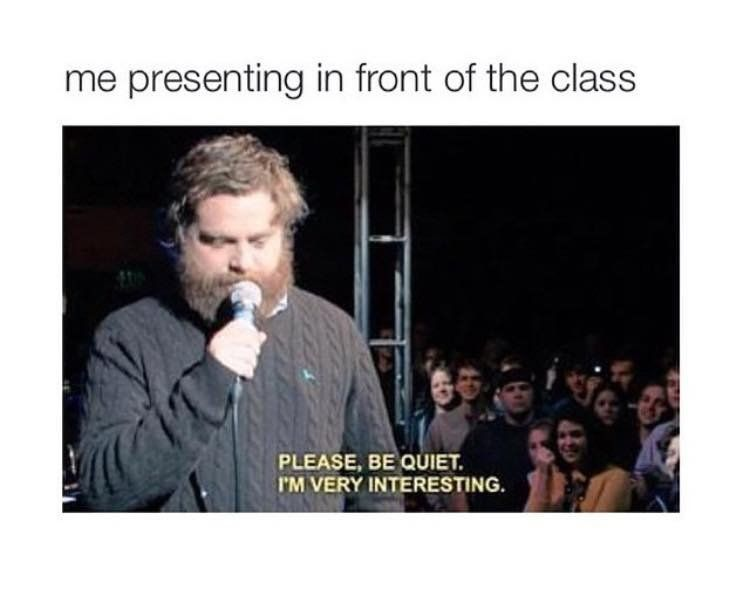

# Week 10: Oct 29

**Topic**  
Communicating our destination: Why should anyone care?

A huge part of research is collecting data. But let's say we have the data. Now what? What does the data mean? Why is it important? What does it tell us, and why does that matter? We care a lot about our data, because we've likely spent months or years collecting it and we are deeply intimate with our research question and what we hope to accomplish. But most people are busy. Most people won't know anything about what you've done or why or what's important about it. The job of convincing folks is on us, and we have a limited window to make our case.

{width="65%"}

There are two main ways we communicate our research work: talks and manuscripts. Talks will vary a lot depending on where we give them, but in general, when we give a talk we aim to provide a compelling narrative within which our data fits. We don't focus on the specific code that manipulated our data, or the exact DNA extraction kit we used. Instead, we orient our audience in the big picture of where our work sits, and tell them a story about why we set out to collect the data we did and what conclusions we drew from it. No one wants to sit through a talk of, "and then I did this, and then I did this, and then I did this other thing..." We want to know _why_ and _what it means_! 

Manuscipts communicate our work differently than talks. These must of course include the big picture too, but manuscipts also include all the nitty-gritty details of your statistical methdologies and the specific DNA extraction kit you used. Thoughts must be clearly stated and flow in logical order.[^35] In science, manuscripts tend to have specific formatting and content requirements that must be closely followed. They almost always consist of an Abstract, Introduction, Methods and Materials, Results, and Discussion sections. Each section communicates different but important information that allows others to evaluate the merit of your work.

\

<blockquote class="twitter-tweet">
Pretty sick I have the same writing process as Miyazaki <a href="https://t.co/LGmYkjrJ4e">pic.twitter.com/LGmYkjrJ4e</a>
&mdash; Xiong Ceda 熊思达 (@slobear) <a href="https://twitter.com/slobear/status/1349991679193874436?ref_src=twsrc%5Etfw">January 15, 2021</a></blockquote> 

\

Like most things we've discussed in class so far, these are skills that require developing. Most of us are not born with the ability to be engaging public speakers. I think I wrote my first manuscript a dozen[^36] times before it was ready for submission. So this week, we will dive into what it takes to be successful at communicating our work in speech and writing, and discuss methods of developing these skills as young scholars.

## Watch

**The greatest TED Talk ever sold | Morgan Spurlock**  

<iframe width="560" height="315" src="https://www.youtube.com/embed/Y2jyjfcp1as" title="YouTube video player" frameborder="0" allow="accelerometer; autoplay; clipboard-write; encrypted-media; gyroscope; picture-in-picture" allowfullscreen></iframe>

**Science Of Persuasion | influenceatwork**  

<iframe width="560" height="315" src="https://www.youtube.com/embed/cFdCzN7RYbw" title="YouTube video player" frameborder="0" allow="accelerometer; autoplay; clipboard-write; encrypted-media; gyroscope; picture-in-picture" allowfullscreen></iframe>

<blockquote class="twitter-tweet">
“I’m tired of marching for something that should’ve been mine at birth” <a href="https://t.co/fkGXOFbaL1">pic.twitter.com/fkGXOFbaL1</a>
&mdash; Wayne Bryant (@BryantWay) <a href="https://twitter.com/BryantWay/status/1351200893102907399?ref_src=twsrc%5Etfw">January 18, 2021</a></blockquote> 

<!-- **"I've Been To The Mountaintop" excerpt | Martin Luther King, Jr.**   -->
<!-- <iframe width="560" height="315" src="https://www.youtube.com/embed/Oehry1JC9Rk" title="YouTube video player" frameborder="0" allow="accelerometer; autoplay; clipboard-write; encrypted-media; gyroscope; picture-in-picture" allowfullscreen></iframe> -->

## Read

+ Book excerpt: [_Made to Stick: Why some ideas survive and others die_](https://uofi.box.com/s/j81ml07als8wmafr863ws25le0cr1bx6)

## Do

_Due no later than Thursday, November 4 at 11:59p_

You have two options for your assignment this week which you will do following the guidelines we discuss in class. **The first option** is to write a 1-2 page summary of your research work that would be appropriate for a non-expert. You need to tell me what you did (or what you will do), but you need to communicate the big picture: convince me that what you are doing is important and necessary to the world. I want to _want_ to keep reading!

**The second option** is to record yourself giving a three-to-five minute summary of your research work. (You can do this on your phone or tablet, or record a Zoom session with yourself. If you want more tips on this, see me after class!) For PhD students, there are competitions like ["3 Minute Thesis"](https://grad.uic.edu/events/3mt-2021/) where you need to effectively explain your whole dissertation in three minutes. This is challenging but a wonderful exercise for you to clarify your ideas succinctly.

\

**Name of Assignmemt:** LASTNAME-ResearchSummary (submit as PDF, Word Document, or text file OR video file)  

[[SUBMIT ASSIGNMENT](mailto:Assignm.zdy620uccrymlqti@u.box.com)]

[^35]: Clear to whom? Whose logic? We'll get to that in class.
[^36]: Probably more!
