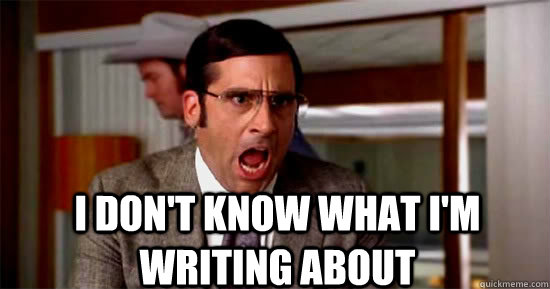

# Week 11: Nov 5

**Topic**  
Communicating our destination: Where do we go from here?

When I first applied to graduate school as a senior in college, I had no idea what I was doing. I didn't research any of the schools very carefully. I didn't contact potential advisors. I didn't have any experience. I didn't even know exactly _why_ I wanted to attend graduate school, just that I was finishing college and had no clue what to do next. I didn't spend a lot of time on my personal statement -- I think I wrote it the night the applications were due. Given the mistakes I made it was really unlikely that I'd get into any schools, and I didn't: I was rejected everywhere I applied.[^34]

{width="65%"}

I was bummed out! That did not feel good! But, I still needed to figure out what to do next. I ended up finding a great job in my field as a Forensic Biologist, and I worked for three years at the NYC Office of Chief Medical Examiner. I gained a lot of valuable experience in that position, and I learned a lot about what mattered to me. So when I finally decided that I wanted -- _really_ wanted -- to get my PhD, I knew exactly why. I knew that I needed to do a lot of careful research about graduate school applications. I spent a lot of time investigating potential schools and advisors. I got to know those potential advisors. I spoke to friends and colleagues that had gone through this process before. I spent a few months writing my personal statement and got tons of feedback on it. And when I arrived, I was emotionally and mentally prepared for the rigors of graduate school.[^32] The point is that there are a lot of viable career paths for us to follow, and which one is right for us depends on a lot of factors that only we can evaluate ourselves.

Many of us are in your last years of study and are beginning to seriously think about what comes next. Whether or not you intend to apply to graduate or professional school, or hit the job market -- a lot can be gained by doing a little research about our intended path. So this week, we will start that process and discuss the pros and cons of the paths we may take after graduation.

## Watch 

**Overcoming Post Graduate Depression | Haydee Alonso**  

<iframe width="560" height="315" src="https://www.youtube.com/embed/QdbMZZVhjVU" title="YouTube video player" frameborder="0" allow="accelerometer; autoplay; clipboard-write; encrypted-media; gyroscope; picture-in-picture" allowfullscreen></iframe>

## Read

### For those of you entering the job market

+ Handbook: [UIC Career Planning Guide](https://careerservices.uic.edu/wp-content/uploads/sites/26/2017/09/CPG-2017.pdf)

You don't need to read the entire thing, but review the parts on the job search and on resusums/CVs/references. Do a little research on Indeed or other job boards to see what kind of jobs are open in your area of interest. Note required and preferred experience.

### For those of you intending to pursue a professional degree

There is a lot of variation in professional schools: medical, law, pharmacy, business, library, and social work all fall under this category. Whatever your plans, I'd like you to select three articles about (1) applying to the school-type of your choice, and (2) how to be successful once you attend. Please send me the URLs of the articles you select and be prepared to discuss what you learn in class!

### For those of you intending to pursue a PhD[^33]

+ Article: ["Some modest advice for graduate students"](https://stearnslab.yale.edu/modest-advice)
+ Article: ["Dear Brilliant Students: Please consider not doing a PhD"](https://liv.dreamwidth.org/389934.html)
+ Article: ["So long, and thanks for the PhD!"](https://www.cs.unc.edu/~azuma/hitch4.html) (_long, but worth it if you're serious about PhD school!_)

### For those of you that don't have a dang clue

I feel you! Read through any of the materials above or do some research on career opportunities in your area of interest. Send me the URLs of any new articles you find.

## Do

_Due no later than Thursday, November 11 at 11:59p_

[^32]: Sort of, anyway. Enough not to quit!
[^33]: I chose articles for you, brave souls, since these articles resonated the most with my own experiences in PhD school. If you find other articles that are discipline-specific that you would rather read, go ahead and send me those URLs.
[^34]: `r emo::ji("sob")`