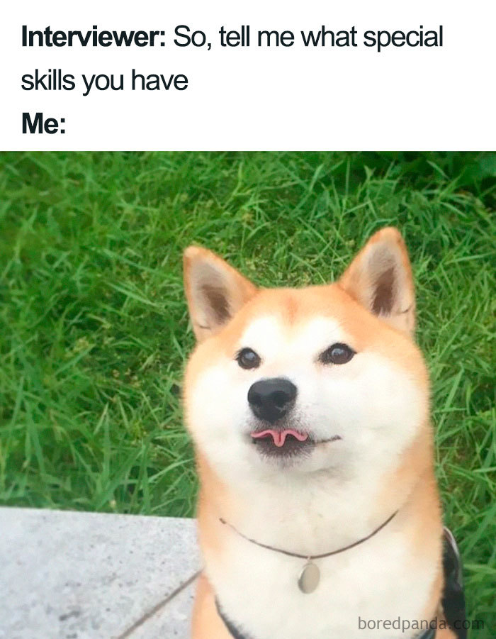

# Week 13: Nov 19

**Topic**  
Developing our explorer identities: What does our work mean to us and to the world?

No matter our goals, at some point we will need to begin communicating our professional identities to others in writing and speech. For gradaute school, we'll write personal statements and meet with potential advisors and colleagues. Entering the job market, we'll write cover letters and participate in interviews.[^41] Resumes and CVs provide a list of our accomplishments that may get our materials on someone's desk. From there, it's up to us to provide a compelling case that we are truly capable of whatever the task at hand -- conducting independent research, working as part of a corporate team, or advancing successfully in medical school. Creating a compelling case involves constructing a narrative that weaves our personal values in with our experience and skills.

{width="50%"}

At its core, there is really only one question we hope to answer with our compelling narrative: will we be successful? It's our job to know what it means to "be successful" and to clearly demonstrate that we have the relevant skills and experience to do so. _Success_ means something different for PhD school, other professional schools, or industry jobs,[^42] so it's worth taking some time to first consider the attributes of a successful candidate. Once we understand that, we may begin building the case for our success -- using tangible, concrete examples. We want to include a bit of ourselves and our worldview as it relates to our future success, but unlike college admissions essays, cover letters and personal statements aren't as much about our personal journey as our _professional_ one. 

While not everyone is planning to attend graduate school, the act of writing a personal (professional) statement[^43] is a valuable reflective exercise for anyone that intends to do any kind of work after college. So this week, we will consider what attributes and experiences may indicate future success in a particular position, and how those attributes and experiences can be communicated effectively. We will focus on writing, but consider how we may translate this work into compelling answers to commonly-asked interview questions.

## Watch

**It's Not Manipulation, It's Strategic Communication | Keisha Brewer**  

<iframe width="560" height="315" src="https://www.youtube.com/embed/QGeHS4jO0X0" title="YouTube video player" frameborder="0" allow="accelerometer; autoplay; clipboard-write; encrypted-media; gyroscope; picture-in-picture" allowfullscreen></iframe>

**The magical science of storytelling | David JP Phillips**  

<iframe width="560" height="315" src="https://www.youtube.com/embed/Nj-hdQMa3uA" title="YouTube video player" frameborder="0" allow="accelerometer; autoplay; clipboard-write; encrypted-media; gyroscope; picture-in-picture" allowfullscreen></iframe>

## Read

+ Article: ["How to Write a Great Statement of Purpose"](https://uni.edu/~gotera/gradapp/stmtpurpose.htm)
+ Article ["Writing Your Academic Statement of Purpose"](https://gradschool.cornell.edu/diversity-inclusion/recruitment-2/prospective-students/writing-your-statement-of-purpose/)

## Do
 
_Due no later than Thursday, December 2 at 11:59pm_

Your homework this week is a first draft of your personal statement. It should be at least one page, but no longer than two, and tailored to your specific goals following graduation. 

\

**Name of Assignmemt:** LASTNAME-PersonalStatement (submit as PDF, Word Document, or text file)  

[[SUBMIT ASSIGNMENT](mailto:Assignm.t7b7au56u02ynxbk@u.box.com)]

[^41]: Probably a lot! It is not uncommon to do several rounds of interviews with many different people for a single job offer.
[^42]: For example, in PhD school, _success_ means a good deal more than simply graduating.
[^43]: Also known as a "Statement of Purpose"