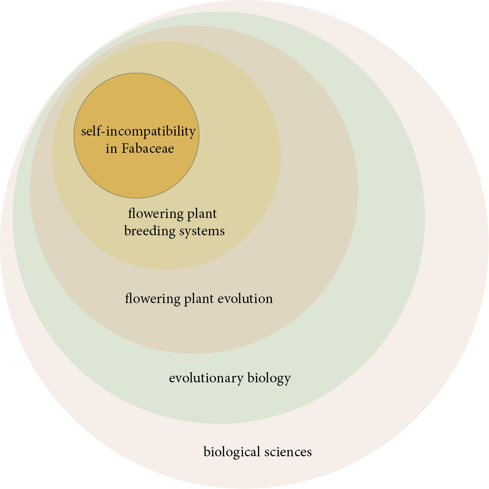

# Week 2: Sep 3

**Topic**  
Finding our Direction: What interests us?

The first stop of any research endeavor is nailing down an area of interest. Hopefully, most of us have a sense of the general field we wish to investigate. No matter how granular a research question can get, it can always be tied back to a broader field of study. For instance, one of my dissertation chapters asks the question, _What is the phylogenetic distribution and frequency of self-incompatibility in Fabaceae?_ This question exists in a sort of "topical heirarchy" from specific to broad like so:

{width="90%"}

It's not important that you know what all of these terms mean, just that you can see that research questions are usually very specific but exist within a broader field like "art" or "biology" or "philosophy." (Those fields exist within even broader categories, like the sciences or humanities.) Within a discipline like philosophy, there are then sub-disciplines that are also quite broad, like epistemology, metaphysics, or aesthetics.

Our job this week is to start investigating the various sub-disciplines within our field so that we may find an area of interest for our research. There are lots of questions in the world -- and to find them requires reading!

## Watch 

**Research 101 - Part 1: Finding a Topic | Cal Poly Pomona University Library**  
<iframe width="560" height="315" src="https://www.youtube.com/embed/VijUoD0jJNY" title="YouTube video player" frameborder="0" allow="accelerometer; autoplay; clipboard-write; encrypted-media; gyroscope; picture-in-picture" allowfullscreen></iframe>

**Developing a Research Question | Steely Library NKU**  
<iframe width="560" height="315" src="https://www.youtube.com/embed/LWLYCYeCFak" title="YouTube video player" frameborder="0" allow="accelerometer; autoplay; clipboard-write; encrypted-media; gyroscope; picture-in-picture" allowfullscreen></iframe>

## Read

+ Journal article: ["How to Read a Review Paper"](https://uofi.box.com/s/f4gnv0e68mp0rqfvyr4wophyl9o6zlvo)
+ Article: [Research articles versus review articles](https://guides.lib.lsu.edu/c.php?g=376856&p=2550574)
+ Article: [Identifying primary and secondary sources](https://sccollege.edu/Library/Pages/primarysources.aspx)

## Do

_Due no later than Thursday, September 9 at 11:59p_