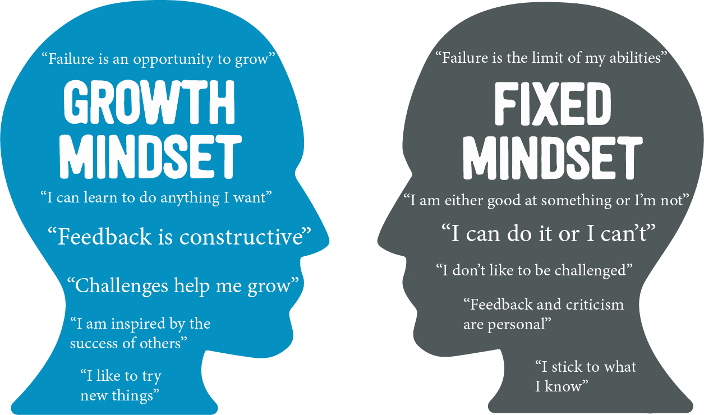

# Week 3: Sep 10

**Topic**   
Finding our direction: What if we aren't good at this?

Carol Dweck and her colleagues began investigating failure in young children decades ago. What they found is that while some students rebounded quickly from failure, others were devastated by the experience. They coined the terms "growth mindset" and "fixed mindset" to describe the beliefs underlying these two reactions to failure. When students had a growth mindset, they believed they could get smarter and knew that effort would help them improve. 

{width=90%}

It's easy to believe that not being good at something right away means that we "aren't cut out for it" or that we "aren't the kind of person who is good at [fill in the blank]." While not all of us are cut out to play basketball like Michael Jordan -- that is, Michael Jordan has innate physical abilities that not everyone is born with -- what _really_ made Michael Jordan the best basketball player of all time was was his tenacious dedication to hard work. He was incredibly talented, of course, but plenty of talented basketball players don't ever enjoy the level of achievement that Michael did. His dedication elevated everyone around him. (If you haven't seen _The Last Dance_[^2], give it a watch and you'll see what I mean.) He knows the real truth: that being the best cannot come from talent alone. It comes from work, and it comes from failure. In fact, a failure isn't really a "failure," so much as an opportunity to learn and grow.

Doing something new is hard. It's hard to feel like a beginner. Many of us start out our independent research projects with an idea of what it will be like, and when it doesn't go that way we think, _I'm just not cut out for this_. But that couldn't be further from the truth. All great achievements start with beginners. All great achievements have a million tiny (and sometimes big!) failures baked into them. So this week, we will start considering the power of our mindsets and how we can weild that power in our journey as young scholars.

## Watch

**The power of believing that you can improve | Carol Dweck**  

<iframe width="560" height="315" src="https://www.youtube.com/embed/_X0mgOOSpLU" title="YouTube video player" frameborder="0" allow="accelerometer; autoplay; clipboard-write; encrypted-media; gyroscope; picture-in-picture" allowfullscreen></iframe>

**Change your mindset, change the game | Dr. Alia Crum**  

<iframe width="560" height="315" src="https://www.youtube.com/embed/0tqq66zwa7g" title="YouTube video player" frameborder="0" allow="accelerometer; autoplay; clipboard-write; encrypted-media; gyroscope; picture-in-picture" allowfullscreen></iframe>

## Read

+ Article: [The Secret to Raising Smart Kids](https://www.scientificamerican.com/article/the-secret-to-raising-smart-kids1/)

## Do

_Due no later than Thursday, September 16 at 11:59p_

For homework, we're going to test our our creative engines and write a short story, five paragraphs (you are welcome to write more if you become inspired to do so) as outlined below:

1. Describe an event in the first paragraph that could elicit either growth mindset thinking or fixed mindset thinking. 
2. Spend two paragraphs reflecting on how you or your character would think about this event from a fixed mindset perspective.
3. Spend two paragraphs reflecting on how you or your character would think about this event from a growth mindset perspective.

\

**Name of Assignmemt:** LASTNAME-Story (submit as PDF, Word Document, or text file)  

[[SUBMIT ASSIGNMENT](mailto:Assignm.2dsjq1qg94qti0bn@u.box.com)]

[^2]: [Netflix: _The Last Dance_]((https://www.netflix.com/title/80203144))
