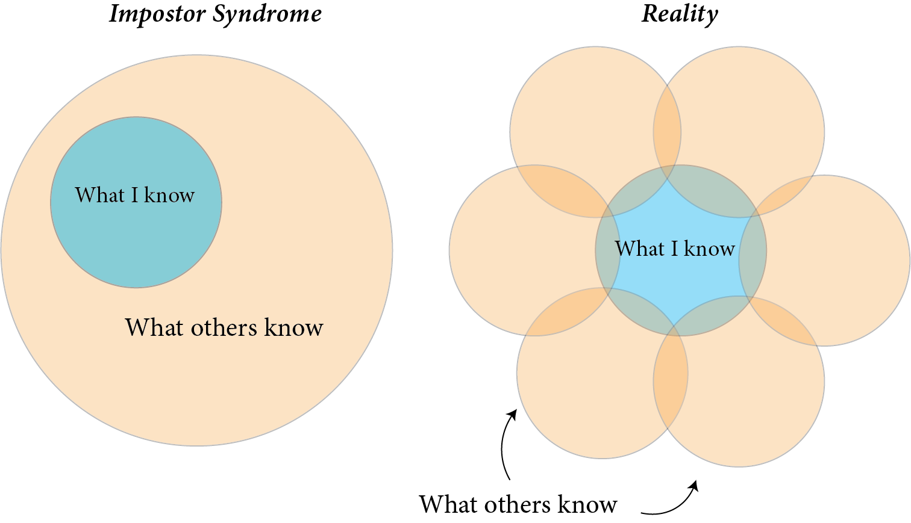

# Week 5: Sep 24

**Topic**  
Planning our destination: What if people think our questions are stupid?

Clance and Imes (1978)[^3] first coined the term "impostor phenomenon" to describe a state of mind where a person's external achievements are at odds with their internal perception of their skills. The study focused on a group of women that possessed all the markers of successful individuals, including academic achievements, high standardized test scores, and external recognition of professional excellence -- but each felt that their success was an accident or that they did not belong in their current positions. A major conclusion was that these women unknowingly internalized the belief the women in general were inherently less capable,[^25] and to reconcile this belief with their own success they reasoned that their success must be fake. 

To understand why this may happen, let's first unpack the term _cognitive dissonance_. Cognitive dissonance is a term used to describe the discomfort experienced when there are inconsistencies within ones own mind. Let's say that I spend my free time advocating for workers rights, but I do all my shopping on Amazon. How do I reconcile these two things internally? Can I consider myself a champion of workers rights while also supporting a company that treats its workers poorly? This inconsistency can cause _cognitive dissonance_ -- to restore _cognitive resonance_, I may need to change my shopping habits, change my beliefs about workers rights or Amazon, or actively push these thoughts out of my head altogether. Which is to say, it requires a bit of mental gymnastics.

We now know that impostor syndrome is not just limited to women, and that it affects all kinds of people, even high-achievers like Einstein. In fact, impostor syndrome is incredibly common, especially in the world of academia. It likely has a lot to do with reconciling the beliefs we have about ourselves and our own knowledge, along with the beliefs we have about others. Especially in the achievement-driven culture of academia, we regularly hear about the successes of others, but rarely do people list all the failures underlying those successes on their CVs. This leads to the illustion that folks are out there succeeding left and right, while we alone struggle with roadblocks.

{width=90%}

There is also a tendancy to think that others know a great deal more than we do. We can't fully know the mind of another person, so we assume that they must know everything we know, and a whole lot more. And this is just the beginning: impostor syndrome poses many challenges to the pursuit of independent research. While we can achieve great things without believing in ourselves, it's a lot harder than if we did! So this week, we will spend some time discussing the flavors of anxiety that are common to impostor syndrome and how we may combat them in our own lives and in our work. 

{width=90%}

## Watch 

**What is impostor syndrome and how can you combat it? | Elizabeth Cox**  

<iframe width="560" height="315" src="https://www.youtube.com/embed/ZQUxL4Jm1Lo" title="YouTube video player" frameborder="0" allow="accelerometer; autoplay; clipboard-write; encrypted-media; gyroscope; picture-in-picture" allowfullscreen></iframe>

**The Super Mario Effect - Tricking Your Brain into Learning More | Mark Rober**  

<iframe width="560" height="315" src="https://www.youtube.com/embed/9vJRopau0g0" title="YouTube video player" frameborder="0" allow="accelerometer; autoplay; clipboard-write; encrypted-media; gyroscope; picture-in-picture" allowfullscreen></iframe>

## Read

+ Journal article: ["Common Academic Experiences No One Talks About: Repeated Rejection, Impostor Syndrome, and Burnout"](https://uofi.box.com/s/w3sxe4sp0zuer0zqtypv9kkjrztr89go)

## Do

_Due no later than Thursday, September 30 at 11:59p_

1. Choose between **one** of the following worksheets: [Replacing Negative Self-Talk](https://uofi.box.com/s/vy813sxhywwosqwyr5lqkkz8m5areqdi) or [The What-If Bias](https://uofi.box.com/s/p97onhwgog69ndjhjv1unvt1cp1s4qjj)
2. Complete the worksheet.

\

**Name of Assignmemt:** LASTNAME-Worksheet.pdf

[[SUBMIT ASSIGNMENT](Assignm.v0z4y5s3ff8vh42w@u.box.com)]
 

[^3]: [Clance and Imes (1978)](https://psycnet.apa.org/record/1979-26502-001)
[^25]: An unfortunately common belief in the 1970s.