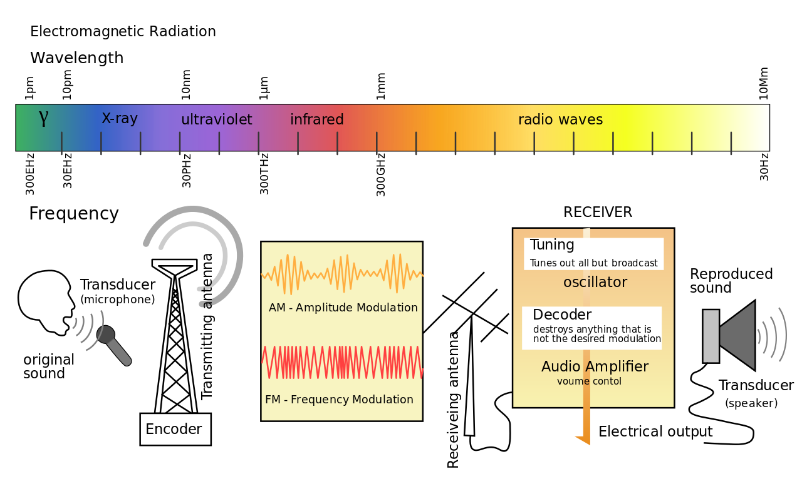

# Week 6: Oct 1

**Topic**  
Detailing our maps: How will we get there?

What does it mean to explain something? Philosophers have been debating about the nature of scientific explanation for more than a century, and there is no clear consensus. Think about it for a minute: how would you characterize and define the necessary components of a "good explanation"? If you ask me how a radio works and I respond that information travels through the air and is picked up by receivers, would that satisfy you? Is that enough data and context to fully explain functioning radios? How is information "traveling" and what is a "receiver"? What if I told you the information was carried by invisible flying horses? There is no method to verify whether or not that's true, and it sounds like a pretty bad explanation. 

Perhaps I would need to first discuss [electromagnetic waves and their various frequencies](https://en.wikipedia.org/wiki/Radio_wave); explain that listening to 91.5 FM means listening to the 91.5 megaHertz frequency; explain that [the transmitter of this radio station](https://en.wikipedia.org/wiki/Transmitter) is oscillating at 91.5 million cycles per second creating a sinusoidal [waveform](https://en.wikipedia.org/wiki/Waveform); explain that the music is [modulated](https://en.wikipedia.org/wiki/Modulation) onto the waveform through variations in the instantaneous frequency (FM = Frequency Modulation) creating a [carrier wave](https://en.wikipedia.org/wiki/Carrier_wave); explain that the carrier wave travels through the air and is then picked up by [a receiver](https://en.wikipedia.org/wiki/Radio_receiver) (your radio) which can extract the music from the modulated signal.

{width=100%}

Whew. That was a lot, and I left out a lot, too: I didn't even explain the components that allow this all to happen or how those components actually function. So is that a "good explanation" of how radios work? While the philosophers continue to debate, what is clear is that the nature of an explanation changes depending on the question that is asked. The question of "how radios work" will likely elicit answers that break down the components necessary for radio transmission and how those components are engineered. But what if instead you ask me _why_ radios work? Well now, a "good explanation" would need to touch on physical laws that describe the behavior of electrons in certain conditions, entering the realm of theoretical physics.

Understanding what makes a "good explanation" is essential to the construction of our research projects for two reasons: (1) we need to know what information is relevant to our work, and (2) we need to know how to gather that information. Explaining _how_ radios work is largely an engineering problem so gathering data on this topic will be very different than explaining _why_ radios work, which is largely a problem of physics. Which is to say, the methods we use to answer our research questions will vary based on the questions we ask and the relevant information necessary to answer them. This is crucial, because providing a convincing explanation of a phenomenon can be harder than it seems. 

\

<blockquote class="twitter-tweet" data-dnt="true">
What&#39;s the dumbest beliefs you had as a child?  When I was 4-5 I swore that bird seeds grew birds, thus the name. When my parents asked me to prove it to them, I planted a pile of bird seeds.  The next day there were loads of birds where I planted the seeds, showing I was right.
&mdash; _grimm (@ExileGrimm) <a href="https://twitter.com/ExileGrimm/status/1412448161688215553?ref_src=twsrc%5Etfw">July 6, 2021</a></blockquote> 

\

My thesis chapters mostly ask exploratory questions (remember: _What is the phylogenetic distribution and frequency of self-incompatibility in Fabaceae?_), but I employ various methods to approach each question. One method is referred to as "meta-analysis": gathering data from hundreds (or thousands!) of published scientific studies and synthesizing this data to determine what we know in a particular area. For other questions, I designed my own tools to gather and synthesize data from scratch. What tools? What data? All this depends on what we want to know, which depends on what question we wish to answer. Research in the humanities or creative arts may look very different than research in applied physics: so this week, we will spend time exploring various research methodologies and their utility to gather relevant information necessary to answer our questions.

## Watch 

**Exploratory, Descriptive, and Explanatory Nature Of Research | MeanThat**  

<iframe width="560" height="315" src="https://www.youtube.com/embed/FlBFdEgrTBM" title="YouTube video player" frameborder="0" allow="accelerometer; autoplay; clipboard-write; encrypted-media; gyroscope; picture-in-picture" allowfullscreen></iframe>

**What is Research Design?| PHILO-Notes**  

<iframe width="560" height="315" src="https://www.youtube.com/embed/IwJVnfw44SU" title="YouTube video player" frameborder="0" allow="accelerometer; autoplay; clipboard-write; encrypted-media; gyroscope; picture-in-picture" allowfullscreen></iframe>

## Read

+ Book excerpt: [_Research Methodology: Tools and Techniques_](https://uofi.box.com/s/q4xo4rpkbemz580g4wf3jzeh8wglvuvy)

## Do

_Due no later than Thursday, October 7 at 11:59p_

Write 1-2 pages outlining the methodology you will use to answer your research question. You should touch on the following aspects:

1. Restate your research problem and the assumptions underpinning your study.
2. Explain broadly the kind of research you intend to do and how it will help address your research problem (e.g., you will use a qualitative research design to address your descriptive research question).
3. Describe what methods you plan to use to gather, analyze, and process the information in your study. (You don't need to go into nitty-gritty details about what statistical procedures you plan to use. But you should be able to articulate broadly how you will analyze your data to address your question, e.g., "I will compare the results from my survey to the other variables I collected to uncover possible correlations.")
4. Justify how these methods specifically address your research problem.

\

**Name of Assignmemt:** LASTNAME-Methodology (submit as PDF, Word Document, or text file)  

[[SUBMIT ASSIGNMENT](Assignm.rt6qthhlv1tnkkol@u.box.com)]

