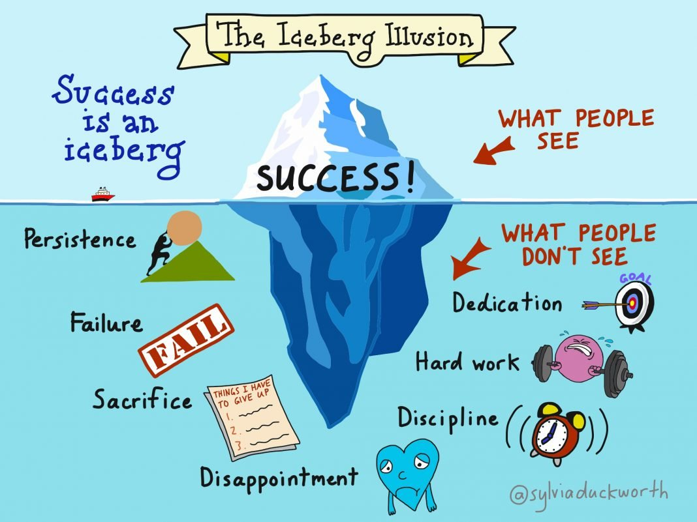

# Week 9: Oct 22

**Topic**  
Honing our skills: What if it doesn't work?

I have emphasized failure a lot throughout this course. Why? Why would I emphasize failure in a course designed to help us succeed in our research projects? Truthfully, most of the successes in my academic and professional life were the result of many previous failures. Failure has power: the power to teach us new information that can guide our future decisions, the power to improve our work, the power to make us stronger as individuals. Failure has the power of wisdom.

\

<blockquote class="twitter-tweet">
Dear Intern,  An engineering manager once told me, “Experience is what you gain from wins, wisdom is what you learn from losses.” Congratulations you just earned some wisdom!  Don’t be afraid to fail. Be afraid of not growing. I’m proud of you.   A Platform Engineer
&mdash; Eddie Herbert (@edward_of_clt) <a href="https://twitter.com/edward_of_clt/status/1405879747687727105?ref_src=twsrc%5Etfw">June 18, 2021</a></blockquote> 

\

When I first applied to graduate school as a senior in college, I had no idea what I was doing. I didn't research any of the schools very carefully. I didn't contact potential advisors. I didn't have any experience. I didn't even know exactly _why_ I wanted to attend graduate school, just that I was finishing college and had no clue what to do next. I didn't spend a lot of time on my personal statement -- I think I wrote it the night the applications were due. Given the mistakes I made it was really unlikely that I'd get into any schools, and I didn't: I was rejected everywhere I applied.

I was bummed out! That did not feel good! But, I still needed to figure out what to do next. I ended up finding a great job in my field as a Forensic Biologist, and I worked for three years at the NYC Office of Chief Medical Examiner. I gained a lot of valuable experience in that position, and I learned a lot about what mattered to me. So when I finally decided that I wanted -- _really_ wanted -- to get my PhD, I knew exactly why. I knew that I needed to do a lot of careful research about graduate school applications. I spent a lot of time investigating potential schools and advisors. I got to know those potential advisors. I spoke to friends and colleagues that had gone through this process before. I spent a few months writing my personal statement and got tons of feedback on it. And of course, you guys all know how the story ends. The point is that my past mistakes and failures are what allow me to succeed here, today.

{width=90%}

I was not prepared for graduate school when I first applied. Looking back, I'm grateful that I didn't get in anywhere. My job helped prepare me mentally and emotionally with the skills I needed to actually be successful in a PhD program. So this week, we will spend some time considering the relationship between failure and wisdom, and discussing how -- if we let them! -- our failures can lead us to success. 

## Watch 

**The Super Mario Effect - Tricking Your Brain into Learning More | Mark Rober**  
<iframe width="560" height="315" src="https://www.youtube.com/embed/9vJRopau0g0" title="YouTube video player" frameborder="0" allow="accelerometer; autoplay; clipboard-write; encrypted-media; gyroscope; picture-in-picture" allowfullscreen></iframe>

**A Physics Prof Bet Me $10,000 I'm Wrong | Veritasium**  
<iframe width="560" height="315" src="https://www.youtube.com/embed/yCsgoLc_fzI" title="YouTube video player" frameborder="0" allow="accelerometer; autoplay; clipboard-write; encrypted-media; gyroscope; picture-in-picture" allowfullscreen></iframe>

## Read

+ Pick your favorite chapter to read (and be ready to discuss it!): [_Serendipity: Accidental discoveries in science_]()

## Do

_Due no later than Thursday, October 28 at 11:59p_