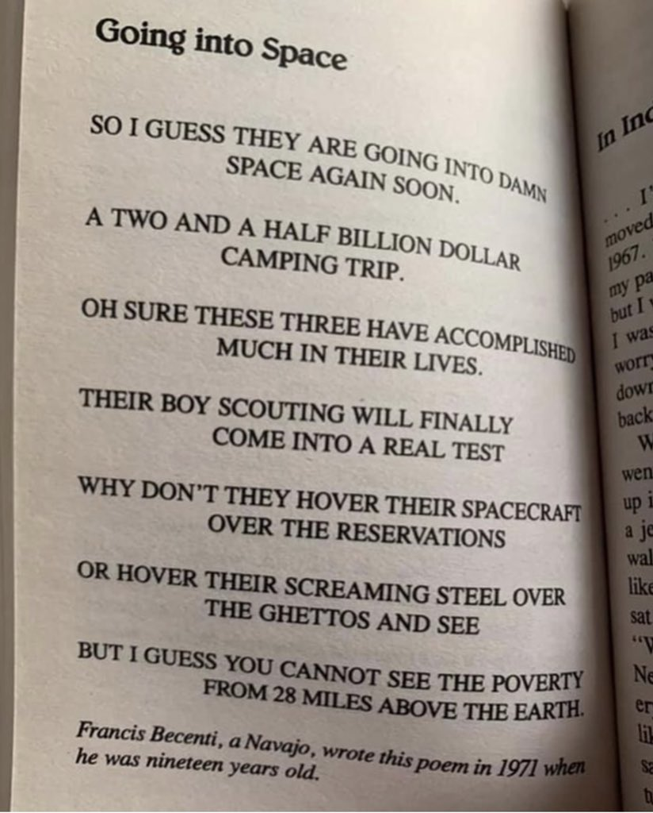

# Week 9: Oct 22

**Topic**  
Honing our skills: Who gets to do research?

Access to educational opportunity -- like many things in this country -- is not equal nor equitable. [The numbers are very clear](https://en.wikipedia.org/wiki/Racial_achievement_gap_in_the_United_States): large and persistent disparities exist in educational attainment across racial and ethnic groups. A long history of systematic oppression and segregation, institutionalized discriminatory practices, and income inequality mean that our colleges and universities are composed of disproportionately more White students and an overwhelmingly White faculty. [White-dominant culture operates as a social mechanism through which White folks are granted advantages by being the "default" racial identity -- all while holding the majority of the political, institutional, and economic power.](https://nmaahc.si.edu/learn/talking-about-race/topics/whiteness)

](images/racial-inequalities.png){width="85%"}

And of course, the work of academia -- our research -- is not done in a vacuum. As we know from our class discussions, who we are and the way we view the world has an enormous influence on our work. But beyond that: who decides what work is important? Who decides what questions are worth asking and answering? Who interprets the data, and through what lens do they interpret it? Whose scholarship is respected and valued? 

{width="65%"}

This week, we will spend our time in class critically examining the institution of academia -- as a place of higher learning and a place of research -- and 

## Watch 

**on interlocking systems of domination | bell hooks**  
<iframe width="560" height="315" src="https://www.youtube.com/embed/sUpY8PZlgV8" title="YouTube video player" frameborder="0" allow="accelerometer; autoplay; clipboard-write; encrypted-media; gyroscope; picture-in-picture" allowfullscreen></iframe>

**Why is my curriculum white? | UCL**  
<iframe width="560" height="315" src="https://www.youtube.com/embed/Dscx4h2l-Pk" title="YouTube video player" frameborder="0" allow="accelerometer; autoplay; clipboard-write; encrypted-media; gyroscope; picture-in-picture" allowfullscreen></iframe>

**On Diversity: Access Ain't Inclusion | Anthony Jack**  
<iframe width="560" height="315" src="https://www.youtube.com/embed/j7w2Gv7ueOc" title="YouTube video player" frameborder="0" allow="accelerometer; autoplay; clipboard-write; encrypted-media; gyroscope; picture-in-picture" allowfullscreen></iframe>

## Read

+ Prologue: [_How to Suppress Women's Writing_]()
+ Article: ["Science can be used for oppression or liberation"](https://socialistworker.org/2018/04/11/science-can-be-used-for-oppression-or-liberation)
+ Article: ["How our data encodes systematic racism"](https://www.technologyreview.com/2020/12/10/1013617/racism-data-science-artificial-intelligence-ai-opinion/)

## Do

_Due no later than Thursday, October 28 at 11:59p_

You will receive an email from me with your mid-semester progress report this week. I would like you to reflect on this report and what we've accomplished in class so far. For homework, respond to this email and touch on the following:

1. Do you feel comfortable with your progress in the class so far? Do you have anything you wish to add to my report?
2. How are you enjoying HON 301 so far? Is there anything I could do that would improve your experience?
3. What have you found the most difficult so far? What have you enjoyed the most?
4. Do you feel like this class is helping you prepare for your Capstone? If not, what could be improved?
5. Anything else you'd like to share!

