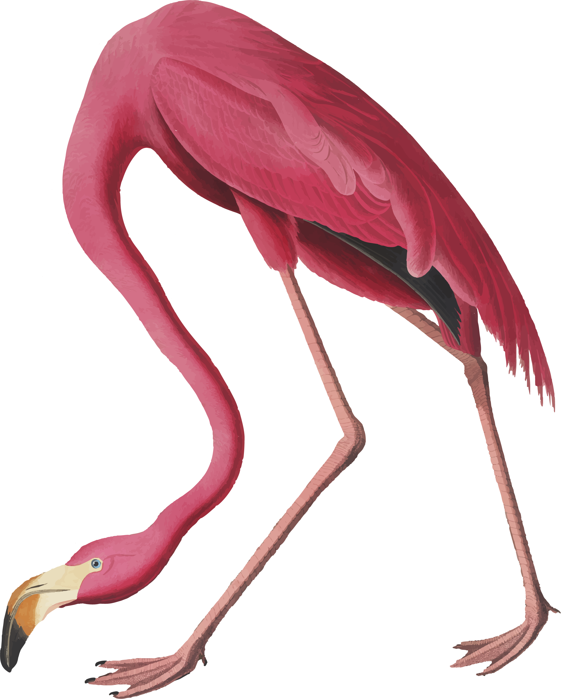

# The Journey Begins {-}

<i class="fas fa-tools fa-lg"></i> _Note: This website is currently under construction!_ <i class="fas fa-tools fa-lg"></i>

**Instructor:** Lucy Delaney (`ldelan5@uic.edu`)  
**Time:** Fridays 2:00-2:50pm  
**Classroom:** BH 304  
**Drop-in Hours:** Fridays 3:00-4:00p or by appointment

{.cover width="38%"} This is an exciting time in your scholarly careers! I think of it like this: for so much of our time in school, there is a clearly paved road for us to follow. Our teachers provide us with detailed maps and a compass, just in case we get turned around. They show us how to read our compass and follow the signposts as we make our way down the road to the final destination -- whether that be successfully completing a course or graduating to the next grade. Our teachers always know whether or not we're doing the right thing, and many of our friends travel with us down the exact same road.

On the other hand, independent research is a bit like being dropped by yourself in the middle of an unfamiliar forest. There is no map and there is no clear destination. You desperately want to ask someone, _Where am I supposed to go?_, or _Do I seriously have to climb this mountain right now?_ but no one can give you answers: no one knows the path you must take except for you.

This course is about two things: 

1. establishing practical skills to aid in our work as young scholars (think: reading our compass, weilding our machetes, and developing the endurance to climb that mountain), and  
2. establishing a professional identity by examining the personal motivations that drive our work (think: learning to create our own maps and discovering where we truly want to go).